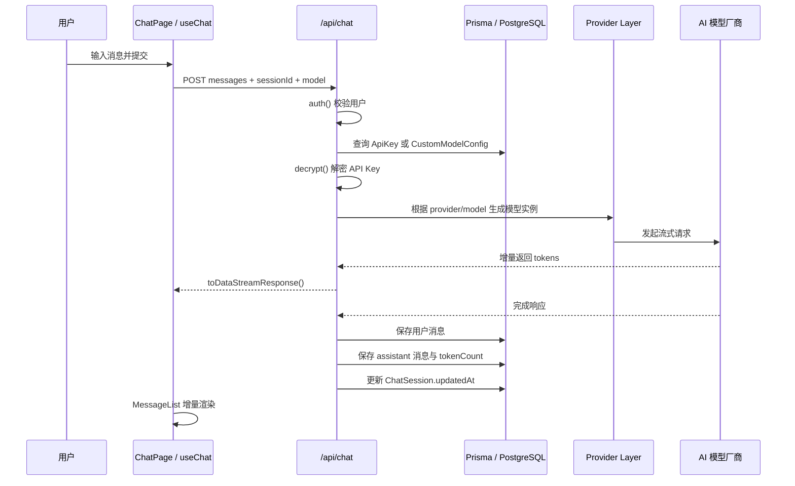

# ChatFlow 项目架构总览

更新时间：2026-04-13

本文档基于当前仓库里的实际实现整理，目标不是描述“理想设计”，而是回答下面几个更实用的问题：

- 这个项目现在到底是怎么搭起来的
- 前端、后端、认证、模型调用、数据库各自负责什么
- 一条聊天消息从输入到流式返回，再到落库，经过了哪些环节
- 后续继续扩展时，应该优先从哪些模块入手

## 一句话概括

ChatFlow 是一个基于 `Next.js 15 App Router` 的单体全栈聊天应用。

它把：

- React 前端页面
- Next.js Route Handlers 形式的后端 API
- NextAuth 认证
- Prisma 数据访问
- 多模型 AI Provider 适配

全部放在同一个工程里。浏览器只与当前 Next.js 应用通信，Next.js 在服务端统一完成认证、会话校验、API Key 解密、模型路由、流式调用和数据持久化。


## 技术栈与职责分工

| 技术 | 作用 | 当前项目中的具体职责 |
| --- | --- | --- |
| Next.js 15 App Router | 全栈框架 | 承担页面路由、服务端 API、布局组织、构建和部署主容器 |
| React 19 | 前端 UI | 负责聊天页、会话抽屉、设置弹窗、登录页等交互界面 |
| NextAuth v5 beta | 认证 | 管理 OAuth 登录、服务端 `auth()`、客户端 `SessionProvider` |
| Prisma | ORM / 数据访问层 | 统一访问 PostgreSQL，处理用户、会话、消息、密钥和自定义模型配置 |
| PostgreSQL | 持久化存储 | 存储业务数据和 NextAuth 相关数据 |
| Vercel AI SDK | AI 调用与流式返回 | 前端 `useChat`、服务端 `streamText`、流式响应封装 |
| `@ai-sdk/openai` / `@ai-sdk/anthropic` | Provider SDK | 连接 OpenAI、Anthropic 以及 OpenAI-compatible 厂商 |
| Zustand | 轻量状态管理 | 保存当前会话、当前模型、图片缓存、抽屉状态等 UI/会话状态 |
| Tailwind CSS + shadcn/ui | UI 基础设施 | 负责样式系统、基础交互组件和页面布局 |
| Jest + Testing Library | 测试 | 覆盖 API、组件、store、hooks、脚本等主干逻辑 |

## 架构风格

当前项目采用的是一种很实用的“单体全栈 + BFF + 扁平分层”结构。

### 1. 单体全栈

前后端不拆仓、不拆服务。页面、API、认证、数据库访问都在一个 Next.js 仓库里。

优点：

- 开发速度快
- 共享类型方便
- 调试链路短
- 很适合个人项目和快速迭代

代价：

- 随着业务变复杂，边界需要靠代码约定维持
- API 与 UI 共仓后，模块职责更需要自律

### 2. BFF 模式

浏览器不会直接去请求数据库或模型厂商，而是全部经过当前项目服务端的 Route Handlers：

- `/api/chat`
- `/api/sessions`
- `/api/keys`
- `/api/custom-models`

这样做的价值是：

- API Key 不暴露到浏览器
- 可以统一做鉴权、参数校验、错误处理和数据格式适配
- 能把多个模型供应商收口成一个前端可消费的统一接口

### 3. 扁平分层

当前目录结构没有引入特别重的 DDD 或多包拆分，而是按职责做扁平组织：

- `src/app`：页面与 API 入口
- `src/components`：UI 组件
- `src/store`：前端状态
- `src/lib`：服务端与通用逻辑
- `src/types`：类型与模型元信息
- `prisma`：数据库 schema

这和项目定位是一致的：优先保持清晰、可维护、易定位，而不是提前做过度抽象。

## 目录与模块职责

### `src/app`

这是整个系统的入口层。

- `src/app/layout.tsx`
  - 根布局
  - 注入 `SessionProvider`
  - 注入 `TooltipProvider`
  - 全局加载 KaTeX 样式
- `src/app/(chat)/layout.tsx`
  - 聊天区页面壳子
  - 组织 `Header`、`SessionDrawer`、`SettingsDialog`
- `src/app/(chat)/page.tsx`
  - 聊天主页面
  - 负责把认证状态、会话状态、`useChat`、消息加载与输入提交串起来
- `src/app/(auth)/login/page.tsx`
  - 登录页
- `src/app/api/*`
  - 所有后端接口

### `src/components`

这是表现层与交互层。

- `layout`
  - 顶部导航、入口按钮、用户菜单
- `session`
  - 会话抽屉、会话项、会话创建/删除/重命名交互
- `settings`
  - 模型选择
  - API Key 管理
  - 自定义模型管理
- `chat`
  - 消息列表
  - 消息项
  - Markdown 渲染
  - 输入区
- `ui`
  - shadcn/ui 基础组件

### `src/store`

这是客户端轻量状态层。

- `session-store.ts`
  - 当前会话列表
  - 当前激活会话 ID
  - 当前模型
- `chat-store.ts`
  - 当前待发送图片
  - 流式状态
- `settings-store.ts`
  - 会话抽屉开关
  - 主题配置持久化

说明：

- 真正的聊天消息流和输入框内容，当前主链路主要由 `ai/react` 的 `useChat` 接管
- Zustand 更偏向“页面级共享状态”和“聊天辅助状态”

### `src/lib`

这是项目的核心逻辑层。

- `lib/auth`
  - NextAuth 配置
  - 服务端 `auth()`
  - API Key 加解密
- `lib/db`
  - Prisma Client 单例
- `lib/ai`
  - Provider 统一适配
  - 错误响应收口
- `lib/chat`
  - 消息与图片 attachment 的互转逻辑

### `src/types`

这里定义了前后端共享的一些模型信息，尤其是模型元数据：

- 哪些模型可选
- 每个模型属于哪个 provider
- 哪些模型支持图片输入
- 自定义模型 ID 如何编码和解析

## 真实运行机制

这一部分是最关键的。下面按“用户打开页面 -> 登录 -> 创建会话 -> 配 Key -> 发送消息 -> 流式返回 -> 落库”来说明。

### 1. 页面初始化

应用启动后，根布局 `src/app/layout.tsx` 会把 `SessionProvider` 注入全局，这样客户端组件都可以通过 `useSession()` 获取登录状态。

然后聊天布局 `src/app/(chat)/layout.tsx` 负责挂上三个长期存在的区域：

- `Header`
- `SessionDrawer`
- `SettingsDialog`

聊天页主体本身由 `src/app/(chat)/page.tsx` 负责，它是真正把以下几种能力拼起来的地方：

- NextAuth 登录状态
- 当前会话 ID
- 当前模型
- `useChat` 的消息流
- 历史消息加载
- 输入提交和错误提示

### 2. 登录与权限控制

认证由 NextAuth 负责，服务端配置位于：

- `src/lib/auth/auth.config.ts`
- `src/lib/auth/next-auth.ts`

当前实现特点：

- 支持 Google / GitHub OAuth
- 只在环境变量完整时注册 provider
- 会话策略使用 `jwt`
- 登录页固定为 `/login`
- 服务端通过 `auth()` 读取当前用户

权限控制分两层：

#### 第一层：middleware 入口保护

`src/middleware.ts` 会匹配：

- `/api/chat/:path*`
- `/api/sessions/:path*`
- `/api/keys/:path*`

也就是说，这几类接口在进入路由前就已经挂了认证中间件。

#### 第二层：路由内部再次校验

每个核心 API 内部仍然会显式执行：

```ts
const session = await auth()
if (!session?.user?.id) {
  return new Response("Unauthorized", { status: 401 })
}
```

这让每条业务路由自身也具备明确的权限语义。

补充说明：

- `/api/custom-models` 当前没有被 middleware matcher 覆盖
- 但它内部同样执行了 `auth()` 校验
- 所以功能上仍然是受保护的，只是保护位置在路由内部

### 3. 会话初始化机制

会话管理由 `SessionDrawer` 主导。

它的工作流程是：

1. 页面进入后先检查 `useSession()` 的状态
2. 若未登录，直接清空会话状态并展示提示
3. 若已登录，则调用 `GET /api/sessions`
4. 服务端返回当前用户下的会话列表
5. 前端把它们写入 `session-store`
6. 如果列表为空，前端会自动调用 `POST /api/sessions` 创建第一条会话

这就是“登录后若还没有会话，系统自动创建首条会话”的实现来源。

这个设计的意义很大：

- 它避免了“页面能打开但输入框长期不可用”的尴尬状态
- 它让当前聊天页总是尽可能快地进入“可聊”状态

### 4. 模型选择与模型元数据

模型相关的静态元数据集中定义在 `src/types/model.ts`。

这里描述了三类核心信息：

- 模型展示名称
- 模型归属的 provider
- 是否支持图片输入

例如：

- `gpt-4`、`gpt-4o` 属于 `openai`
- `claude-3-5-sonnet` 属于 `anthropic`
- `deepseek-chat` 属于 `deepseek`
- `qwen-plus`、`qwen-turbo` 属于 `qwen`
- `glm-5`、`glm-4.7` 属于 `glm`
- `moonshot-v1-8k`、`kimi-k2` 属于 `kimi`
- `doubao-*` 属于 `doubao`

除此之外，还定义了：

- `CUSTOM_MODEL_PREFIX = "custom:"`
- `parseCustomModelId()`

这意味着前端下拉框里的模型来源其实有两类：

- 内置模型列表
- 通过 `/api/custom-models` 拉到的用户自定义模型

### 5. API Key 与自定义模型配置

设置页 `SettingsDialog` 打开后，会显示两块关键能力：

- `ApiKeyManager`
- `CustomModelManager`

#### API Key 管理

`ApiKeyManager` 的流程是：

1. 打开设置页后请求 `GET /api/keys`
2. 服务端查询当前用户已保存的 provider 记录
3. 前端只拿“是否已配置”和 `endpointId` 之类的公开信息，不拿明文密钥
4. 用户保存时，前端调用 `POST /api/keys`
5. 服务端使用 `encrypt()` 做 AES-256-GCM 加密
6. 加密后的结果写入 `ApiKey` 表

豆包是一个特殊分支：

- 除了 API Key，还要保存 `endpointId`
- 因此 `ApiKey` 表中多了 `endpointId` 字段
- `/api/chat` 在调用豆包前也会再次校验 `endpointId`

#### 自定义模型管理

`CustomModelManager` 允许用户保存：

- 自定义名称
- 自定义 Base URL
- 自定义 Model ID
- 独立绑定的 API Key

这套能力的价值是：

- 用户不需要等系统预置 provider
- 只要接口兼容 OpenAI 风格，就可以接入
- 每条自定义模型都拥有自己的 API Key，不依赖公共 provider Key

### 6. 图片输入链路

虽然 README 有些文字还把项目描述为“本阶段只接入文本聊天链路”，但从当前代码来看，基础图片输入链路其实已经存在。

它的工作方式是：

1. 用户在 `InputArea` 中上传、拖拽或粘贴图片
2. `useImageUpload` 用浏览器 `FileReader + canvas` 进行缩放压缩
3. 图片被转成 Base64 Data URL
4. 图片暂存在 `chat-store.images`
5. 提交消息时，图片会被包装成 `experimental_attachments`
6. 服务端从 attachment 中提取图片 URL
7. 用户消息落库时，图片内容被写入 `Message.images`

当前策略的特点是简单直接，但也有边界：

- 优点是实现成本低、联调快
- 缺点是 Base64 体积大，不适合大规模生产场景

如果后续继续演进，多半会把图片从数据库数组迁到对象存储。

### 7. 聊天请求主链路

这是整个系统最核心的一条路径。



展开来看，这条链路又分为几个关键步骤。

#### 第一步：前端发起请求

`src/app/(chat)/page.tsx` 通过 `useChat()` 把 `/api/chat` 设为消息提交目标，同时把下面两个上下文塞进请求体：

- `sessionId`
- `model`

因此服务端拿到请求时，已经知道：

- 当前要往哪个会话写
- 当前用户选择的是哪个模型

#### 第二步：服务端识别模型类型

`/api/chat` 会先判断传入的 `modelId` 属于哪一类：

- 内置静态模型
- 自定义模型

逻辑入口在：

- `getModelConfig(modelId)`
- `parseCustomModelId(modelId)`

如果不是有效模型，会直接返回 `400 Invalid model`。

#### 第三步：服务端查找密钥

若是内置模型：

- 根据 `staticModelConfig.provider` 去 `ApiKey` 表查当前用户是否配置过该 provider 的密钥

若是自定义模型：

- 去 `CustomModelConfig` 表查对应记录
- 并确认这条配置确实属于当前登录用户

如果缺少 Key，会直接返回一个面向用户的错误消息，例如：

- 请先在设置中配置某 provider 的 API Key
- 自定义模型缺少 API Key

#### 第四步：校验多模态能力

服务端会从最后一条用户消息的 `experimental_attachments` 里提取图片。

如果当前模型不支持图片输入：

- 服务端直接拒绝请求
- 返回 400 错误

这层校验和前端校验是双保险：

- 前端负责改善体验
- 服务端负责保证正确性

#### 第五步：Provider 统一适配

模型适配集中在 `src/lib/ai/providers.ts`。

这里的设计思路非常清晰：

- `Anthropic` 走独立实现
- `OpenAI`、`DeepSeek`、`Qwen`、`GLM`、`Kimi`、`豆包` 走 OpenAI-compatible 通路
- 自定义模型则直接指定自定义 `baseURL + modelId + apiKey`

也就是说，Provider 层对上游 UI 提供的是统一的“给我 provider、modelId、apiKey，我返回可调用模型实例”的接口；
对下游厂商则根据兼容性差异分别适配。

豆包是当前实现中的一个特殊点：

- provider 固定是 `doubao`
- 但真正请求时用的是用户配置的 `endpointId`
- 所以 `/api/chat` 会把 `endpointId` 作为最终的 `resolvedModelId`

#### 第六步：流式调用与落库

准备好模型后，`/api/chat` 会调用 `streamText()`。

在 `onFinish` 回调里，当前实现会依次做三件事：

1. 保存本次用户消息
2. 保存本次助手回复及 `tokenCount`
3. 更新对应 `ChatSession.updatedAt`

这意味着：

- 前端是流式实时看到回复
- 数据库是在完成时统一写入最终结果

当前实现并没有做“中间增量 chunk 持久化”，只保存最终完整答案，这让实现更简单，也更适合当前阶段。

### 8. 前端消息渲染

消息显示分为三层：

#### `MessageList`

- 负责列表容器
- 在消息变化或流式状态变化时自动滚动到底部
- 无消息时显示空态

#### `MessageItem`

- 负责区分用户消息和助手消息
- 用户消息按纯文本展示
- 助手消息交给 `MarkdownRenderer`
- 如果消息包含图片 attachment，也会一起渲染缩略图

#### `MarkdownRenderer`

负责渲染：

- Markdown
- 数学公式
- 代码高亮
- 外链打开方式

这就是为什么助手回复可以自然支持：

- 代码块
- 链接
- LaTeX 公式

## Provider 适配策略

当前 Provider 层的核心策略，可以概括为一句话：

“尽量把不同供应商都收口成统一的 OpenAI-compatible 接口，只有真的不兼容时才单独分支。”

### 当前 provider 分类

#### 独立分支

- `anthropic`

#### OpenAI-compatible 分支

- `openai`
- `deepseek`
- `qwen`
- `glm`
- `kimi`
- `doubao`

#### 自定义兼容分支

- 用户自行配置的 `baseURL + modelId + apiKey`

### 这种设计的好处

- 新增 provider 时改动面小
- 前端几乎不需要知道不同厂商的细节
- 后续扩展成本更低

### 当前要注意的特殊点

- `doubao` 不是直接用静态 `modelId`，而是依赖用户填写的 `endpointId`
- 自定义模型默认被视为支持图片输入，这是一种偏宽松策略，后续如果接入更多供应商，可能需要更细粒度的能力描述

## 数据库结构与数据关系

数据库 schema 定义在 `prisma/schema.prisma`。

### 核心实体

#### `User`

系统中的用户主体。

关联：

- NextAuth 的 `Account`
- NextAuth 的 `Session`
- 业务侧的 `ChatSession`
- 业务侧的 `ApiKey`
- 业务侧的 `CustomModelConfig`

#### `ChatSession`

一次对话会话的元数据。

字段重点：

- `title`
- `model`
- `createdAt`
- `updatedAt`

关联：

- 属于一个 `User`
- 拥有多条 `Message`

#### `Message`

一条具体消息。

字段重点：

- `role`
- `content`
- `images`
- `tokenCount`
- `createdAt`

说明：

- 当前用 `images: String[]` 存图片 Data URL
- 这适合当前开发阶段，但不适合长期大体量场景

#### `ApiKey`

用户按 provider 维度保存的加密密钥。

字段重点：

- `provider`
- `encryptedKey`
- `endpointId`

约束：

- `@@unique([userId, provider])`

也就是一个用户对同一个 provider 只有一条有效配置。

#### `CustomModelConfig`

用户自定义模型配置。

字段重点：

- `name`
- `baseUrl`
- `modelId`
- `encryptedApiKey`

这和 `ApiKey` 最大的区别是：

- `ApiKey` 是按 provider 统一存
- `CustomModelConfig` 是按单条模型实例存

## 状态管理分工

当前项目的状态管理不是“一把梭全放 Zustand”，而是分层处理。

### `useChat`

负责聊天主链路的实时状态：

- 当前消息数组
- 当前输入框内容
- 是否正在请求
- 提交消息
- 接收流式响应

这部分状态和 AI SDK 绑定很深，因此交给 `useChat` 最合适。

### `session-store`

负责页面范围共享的会话状态：

- 当前有哪些会话
- 当前选中了哪条会话
- 当前选中了哪个模型

### `chat-store`

负责聊天辅助状态：

- 待发送图片
- 流式标记

### `settings-store`

负责 UI 偏展示层的状态：

- 左侧会话抽屉是否打开
- 主题模式

## 各层如何协调

如果从“层与层之间如何协作”来理解，这个项目可以拆成下面几条主线。

### 主线 1：认证线

- 客户端 `SessionProvider`
- 页面里 `useSession()`
- 服务端路由里 `auth()`
- 数据库存储由 `PrismaAdapter` 支撑

这条线决定“当前用户是谁、是否允许继续操作”。

### 主线 2：会话线

- `SessionDrawer` 负责会话列表交互
- `/api/sessions` 负责持久化与查询
- `session-store` 负责在页面中共享当前会话状态

这条线决定“当前聊天上下文挂在哪一条会话上”。

### 主线 3：配置线

- 设置页负责收集 provider 配置
- `/api/keys` 与 `/api/custom-models` 负责服务端保存
- `encrypt()` 负责密钥安全性

这条线决定“系统调用哪个模型，以及调用时用哪个密钥”。

### 主线 4：消息线

- `InputArea` 收集文本和图片
- `ChatPage` 通过 `useChat` 发请求
- `/api/chat` 统一调用模型
- `MessageList` 与 `MarkdownRenderer` 展示结果
- `Prisma` 把最终消息持久化

这条线决定“聊天消息如何流动与展示”。

### 主线 5：模型适配线

- `types/model.ts` 管理模型元数据
- `lib/ai/providers.ts` 管理厂商接入差异
- `/api/chat` 做最终路由选择

这条线决定“同一个前端界面如何同时支撑多家模型供应商”。

## 启动与运行环境

从运行角度看，这个项目至少依赖三类外部条件：

### 1. 数据库

必需环境变量：

- `POSTGRES_PRISMA_URL`
- `POSTGRES_URL_NON_POOLING`

作用：

- Prisma 正常连接 PostgreSQL
- NextAuth 的 Adapter 数据也会落在同一个库里

### 2. 认证

基础必需：

- `NEXTAUTH_URL`
- `NEXTAUTH_SECRET`

如需真实 OAuth 登录：

- `GOOGLE_CLIENT_ID`
- `GOOGLE_CLIENT_SECRET`
- `GITHUB_CLIENT_ID`
- `GITHUB_CLIENT_SECRET`

### 3. 密钥加密

必需环境变量：

- `ENCRYPTION_KEY`

作用：

- 给用户保存的 API Key 做 AES-256-GCM 加密

### 本地联调辅助脚本

项目还补了两类很实用的运维脚本：

#### `npm run doctor`

用于检查：

- 环境变量是否存在
- 格式是否合法
- 当前是否具备“能启动”与“能真实联调”的条件

#### `npm run verify:local`

串行执行：

- `npx tsc --noEmit`
- `npm test -- --runInBand`
- `npm run lint`
- `npm run build`

这说明项目当前不仅有业务主线，也有一套比较清晰的本地验证闭环。

## 当前实现边界与观察

这部分不是问题清单，而是帮助后续接手的人更快理解“现在做到哪了”。

### 1. 当前是单体应用，不是微服务架构

这不是缺点，而是项目当前阶段的合理选择。

### 2. AI 厂商接入已经具备可扩展性

新增 OpenAI-compatible 厂商的成本已经比较低，Provider 层设计是当前架构里最有扩展潜力的一层。

### 3. 基础多模态链路已经存在

虽然仓库文档中还有“只接文本”的表述，但从实际代码来看：

- 图片上传
- 图片压缩
- attachment 传输
- 服务端提取图片
- 图片消息落库
- 前端图片展示

这些主干已经具备。

更准确地说，当前项目已经有“基础多模态输入能力”，只是还没有进一步产品化成完整视觉功能体系。

### 4. 当前落库策略偏简单但稳定

消息在模型完成后统一落库，而不是流式 chunk 持续写库。

优点：

- 实现简单
- 一致性更好
- 数据结构也更干净

代价：

- 无法回放中途流式内容
- 对异常中断的追踪会更粗粒度

### 5. 图片存储策略后续可能需要升级

当前 `Message.images` 直接保存 Data URL，这对快速开发非常友好，但如果未来要做：

- 大图片
- 更多图片
- 长期保存
- 更强的性能优化

大概率会迁移到对象存储。

## 建议如何继续扩展

如果后续继续演进这个架构，我会优先按下面几个方向考虑。

### 1. 继续强化模型能力描述

现在模型能力主要只有：

- provider
- modelId
- supportsVision

后续可以继续扩展成更完整的能力模型，比如：

- 是否支持工具调用
- 是否支持联网
- 最大上下文
- 是否支持推理模式
- 是否支持 JSON 输出

### 2. 把消息持久化策略进一步模块化

如果以后要加：

- 失败重试
- 流式中间态记录
- token 统计报表
- 审计日志

可以考虑把 `/api/chat` 中的“模型调用”和“消息持久化”拆得更清楚一些。

### 3. 升级多模态资源存储

把 Base64 图片改成对象存储 URL，会让这条链更适合长期使用。

### 4. 对自定义模型增加更精细的能力配置

现在自定义模型默认支持图片输入，后续可以考虑把能力开关显式化，避免“接口兼容但能力不兼容”的误判。

## 关键文件索引

如果要快速理解代码，建议优先按下面顺序阅读：

### 页面与布局

- `src/app/layout.tsx`
- `src/app/(chat)/layout.tsx`
- `src/app/(chat)/page.tsx`
- `src/app/(auth)/login/page.tsx`

### 聊天 UI

- `src/components/chat/InputArea.tsx`
- `src/components/chat/MessageList.tsx`
- `src/components/chat/MessageItem.tsx`
- `src/components/chat/MarkdownRenderer.tsx`

### 会话与设置

- `src/components/session/SessionDrawer.tsx`
- `src/components/settings/SettingsDialog.tsx`
- `src/components/settings/ApiKeyManager.tsx`
- `src/components/settings/CustomModelManager.tsx`
- `src/components/settings/ModelSelector.tsx`

### 服务端 API

- `src/app/api/chat/route.ts`
- `src/app/api/sessions/route.ts`
- `src/app/api/sessions/[id]/route.ts`
- `src/app/api/keys/route.ts`
- `src/app/api/custom-models/route.ts`
- `src/app/api/custom-models/[id]/route.ts`

### 核心逻辑

- `src/lib/auth/auth.config.ts`
- `src/lib/auth/next-auth.ts`
- `src/lib/auth/encryption.ts`
- `src/lib/ai/providers.ts`
- `src/lib/ai/stream-handler.ts`
- `src/lib/chat/message-parts.ts`
- `src/lib/db/prisma.ts`
- `src/types/model.ts`
- `src/store/session-store.ts`
- `src/store/chat-store.ts`
- `src/store/settings-store.ts`
- `prisma/schema.prisma`

## 总结

ChatFlow 当前已经形成了一套相当完整而清晰的单体全栈聊天架构：

- 前端通过 Next.js + React + Zustand 组织页面与交互
- 服务端通过 Route Handlers 统一承担 BFF 职责
- 认证通过 NextAuth 打通客户端和服务端
- 模型调用通过 Provider 适配层统一抽象
- 持久化通过 Prisma + PostgreSQL 完成
- 用户密钥通过 AES-256-GCM 加密保存

从工程角度看，这个项目最重要的优势不是“用了很多技术”，而是各层分工已经比较明确：

- UI 层关注交互
- API 层关注边界与编排
- Provider 层关注厂商差异
- 数据层关注持久化

这让它既适合继续联调，也适合继续扩展。
